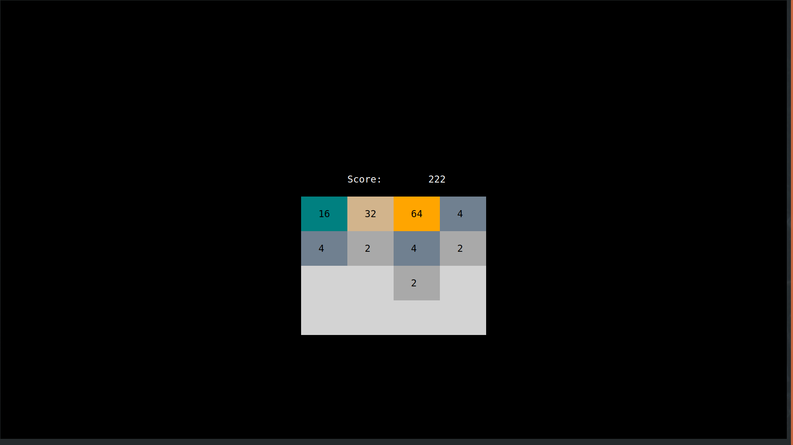

# G048 (v1.0)

## An implementation of 2048 in Go

## Description
This is a text-based version of 2048 written in Go.



## Dependencies
Go lacks a lot of old-school terminal control abilities (`clear`, `getch()`,
etc) so this project uses a 3rd party, cross platform library used by a number
of other text-based Go games, [tcell](https://github.com/gdamore/tcell).

### To Install:
#### Automatic
```bash
make depend
```
#### Manual
```bash
go get "github.com/gdamore/tcell"
```

## Build Intstructions
```bash
make
```

## Usage
```bash
./bin/g048 [help]
```

